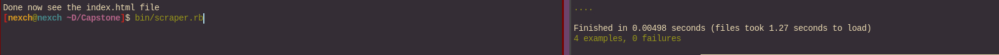
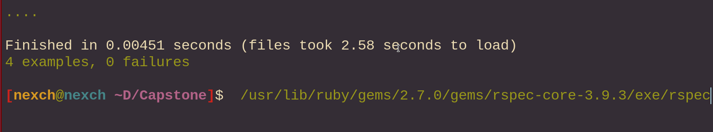

# Capstone


> Project: Capstone #2.



## Built With

- Html
- CSS
- Ruby
- nokogiri
- httparty
- rspec
- rubocop

## Description
- This project only works in for [This page](https://www3.animeflv.net/) if you need more info about the project visit this [link](https://www.notion.so/Build-your-own-scraper-f54eaca54d8a4d758a5f0141468127a8)
- This is a web scraper that grabs a page with different series and picks the last episodes and displays them in an HTML format.
- It was created in the necessity that I expend to much time trying to search for one episode with all the adds
- I like dark mode and the page didn't support it, so I create a new page with only the necessary information and in dark mode
- The page that will be scraped is [This one](https://www3.animeflv.net/)

## Getting Started

To get a local copy up and running follow these simple example steps.

### Prerequisites
Having a computer and git working.
have ruby and the following gems nokogiri and httparty
### Setup
"``` git clone https://github.com/Nexch/Capstone.git ```"
Go to the directory and run ruby like this if you are in linux "``bin/scraper.rb``"
if you are in windows you will have to run it like this in your cmd"``ruby bin/scraper.rb``"
To run the test just use "``rspec``" in the root folder
### Usage
Open the new file locate in the root directory using your favorite browser

### Run test
use the installed gem rspec


## Authors
👤 **Mauricio Tabilo**

- Github: [@Nexch](https://github.com/Nexch)
- Twitter: [@@MfinchT](https://twitter.com/MfinchT)
- Linkedin: [linkedin](https://www.linkedin.com/in/Nexch)

## 🤝 Contributing

Contributions, issues and feature requests are welcome!

Feel free to check the [issues page](issues/).

## Show your support

Give a :fire: if you like this project!

## Acknowledgments

- I will like to express my sincere gratitude to Microverse, this incredible opportunity
- Microverse
